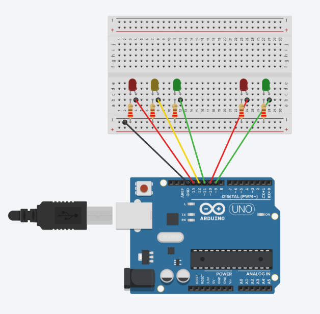
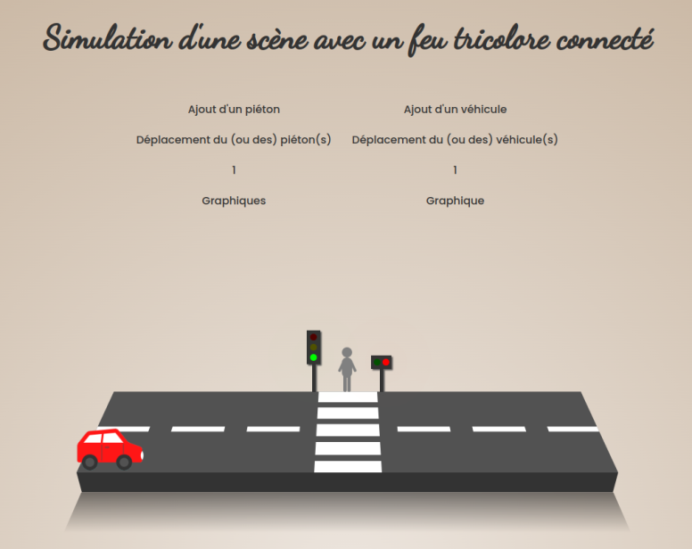

<div align="center">

# Arduino Project - Internet of Things

### Simulation of a scene with a connected traffic light with an Arduino Uno


</div>

<table>
    <thead>
        <tr>
            <th width="150px">Year</th>
            <th width="150px">Course</th>
            <th width="250px">Subject</th>
            <th width="375px">Project</th>
            <th width="325px">Collaborators</th>
        </tr>
    </thead>
    <tbody>
        <tr>
        <td align="center">2022-2023</td>
        <td align="center">M2 IWOCS</td>
        <td align="center">Internet of Things</td>
        <td align="center">Development of an IoT solution</td>
        <td align="center">Léa Gallier & <a href="https://github.com/lrxk">Kévin Leroux</a></td>
        </tr>
    </tbody>
</table>

### Contents

1. [Project display](#project-display)
2. [Sketch](#sketch)
3. [Configuration](#configuration)
4. [Visual of the web interface](#visual-of-the-web-interface)
5. [Sources](#sources)

## Project display

The aim of the project is to detect the number of vehicles approaching the traffic light as well as the number of walkers waiting at the walker crossing. When the walker wants to cross, we will compare his two values ​​and if there are more walkers than vehicles then the light will turn red for vehicles and green for walkers.

Walkers can therefore even cross at a red light in violation of road safety rules. Vehicles can only pass the green light.

The web interface is composed of a small animation in CSS and a user interface on which we can add walkers and vehicles. We can activate the movement of walkers and vehicles. Finally, we can also display graphs on the displacements made by the simulation.
 
## Sketch

Here is a diagram summarizing the circuit made on the Arduino Uno:

<div align="center">

</div>

## Configuration

Launch the sketch in the Arduino IDE available here: `assets/sketch_traffic_light.ino`

Then in the project, in a terminal:

```
cd arduino-project
npm i
npm start
```

And in a new terminal tab (checking to have the right port for the Arduino in the `arduino.js` file: `portName` variable):

```
node arduino.js
```

Finally, we can open the link [following](http://localhost:3001/) and access the web interface.

## Visual of the web interface

<div align="center">

</div>

## Sources

The car image is a graphic offered on the <a title="Canva website" href="https://www.canva.com/">Canva</a> website. All other animation elements were created in pure CSS3.
